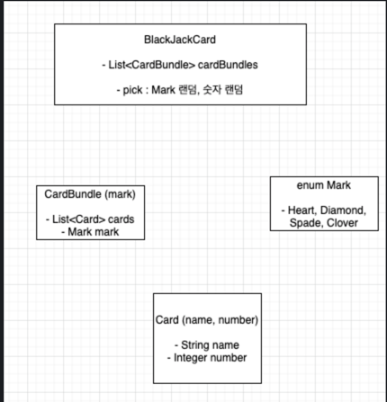

# java-blackjack

## 차량에 따른 연료 주입
###기능 요구 사항

우리 회사는 렌터카를 운영하고 있다. 현재 보유하고 있는 차량은 Sonata 2대, Avante 1대, K5 2대로 총 5대의 차량을 보유하고 있다. 고객이 인터넷으로부터 예약할 때 여행할 목적지의 대략적인 이동거리를 입력 받는다. 이 이동거리를 활용해 차량 별로 필요한 연료를 주입한다. 차량 별로 주입해야 할 연료량을 확인할 수 있는 보고서를 생성해야 한다.

각 차량별 연비는 다음과 같다.

* Sonata : 10km/리터
* Avante : 15km/리터
* K5 : 13km/리터

### 프로그래밍 요구 사항
  상속과 추상 메서드를 활용한다.
  위 요구사항을 if/else 절을 쓰지 않고 구현해야 한다.
  이 요구사항을 만족하는 테스트 코드는 다음과 같다.
  아래 테스트 코드에서 자동차 인스턴스를 생성할 때의 숫자는 자동차로 여행할 거리를 의미한다.

`public class oilInjection.model.RentCompanyTest {
private static final String NEWLINE = System.getProperty("line.separator");`

```java
    @Test
    public void report() throws Exception {
        oilInjection.model.RentCompanyTest company = oilInjection.model.RentCompanyTest.create(); // factory method를 사용해 생성
        company.addCar(new Sonata(150));
        company.addCar(new K5(260));
        company.addCar(new Sonata(120));
        company.addCar(new Avante(300));
        company.addCar(new K5(390));

        String report = company.generateReport();
        assertThat(report).isEqualTo(
            "Sonata : 15리터" + NEWLINE +
            "K5 : 20리터" + NEWLINE +
            "Sonata : 12리터" + NEWLINE +
            "Avante : 20리터" + NEWLINE +
            "K5 : 30리터" + NEWLINE
        );
    }
}
```
### 힌트
앞의 Coffee와 Tea의 예제와 같이 상속을 활용해 구현해야 한다.
공통 기능 구현을 담당할 Car 클래스를 추가한다. Car 클래스에 abstract를 활용한다.
```java
public abstract class Car {
/**
* 리터당 이동 거리. 즉, 연비
*/
abstract double getDistancePerLiter();

    /**
     * 여행하려는 거리
     */
    abstract double getTripDistance();
    
    /**
     * 차종의 이름
     */
    abstract String getName();

    /**
     * 주입해야할 연료량을 구한다.
    */
    double getChargeQuantity() {
        return getTripDistance() / getDistancePerLiter();
    }
}

```
### 프로그래밍 요구사항
인터페이스를 적용해 구현한다.

## 기능정의
0. 렌트카 회사의 자동차 추가(초기화)
1. 고객으로부터 목적지 이동거리 입력받음
   - controller 를 통해 model, oilInjection.view 충돌 해결?
2. 이동거리를 통해 각 차량별 필요 연료 계산
3. 차량 별로 필요한 연료를 주입
4. 차량 별 주입 연료량 확인 보고서 출력

## 클래스 구조도

Car (추상클래스)
ㄴ Sonata
ㄴ Avante
ㄴ Kfive
RentCompany

---

# 블랙잭

## 기능 요구사항
기능 요구 사항
블랙잭 게임을 변형한 프로그램을 구현한다. 블랙잭 게임은 딜러와 플레이어 중 카드의 합이 21 또는 21에 가장 가까운 숫자를 가지는 쪽이 이기는 게임이다.

카드의 숫자 계산은 카드 숫자를 기본으로 하며, 예외로 Ace는 1 또는 11로 계산할 수 있으며, King, Queen, Jack은 각각 10으로 계산한다.

게임을 시작하면 플레이어는 두 장의 카드를 지급 받으며, 두 장의 카드 숫자를 합쳐 21을 초과하지 않으면서 21에 가깝게 만들면 이긴다. 21을 넘지 않을 경우 원한다면 얼마든지 카드를 계속 뽑을 수 있다.

딜러는 처음에 받은 2장의 합계가 16이하이면 반드시 1장의 카드를 추가로 받아야 하고, 17점 이상이면 추가로 받을 수 없다.

게임을 완료한 후 각 플레이어별로 승패를 출력한다.


## 기능정의

1. 참여자 이름 입력
2. 카드 뭉치 셔플
3. 카드 배분
4. 카드 확인
5. 참여자 별 카드 추가 드로우 의사 결정
6. 딜러 카드 드로우 결정
7. 카드 결과 출력
8. 승패 출력


## 구조 설계
**카드 클래스**
- BlackJackCard
    - List<CardBundle>
    
- CardBundle
    - List<Card>
- Card
    - Type
    - Number
- Type
    - Heart, Spade ...
- Number
    - ACE,TWO, THREE, ... , KING

    
